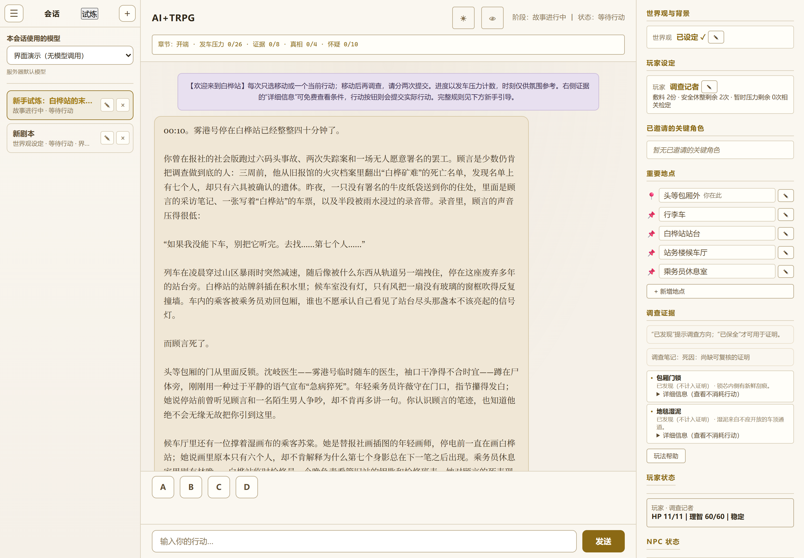
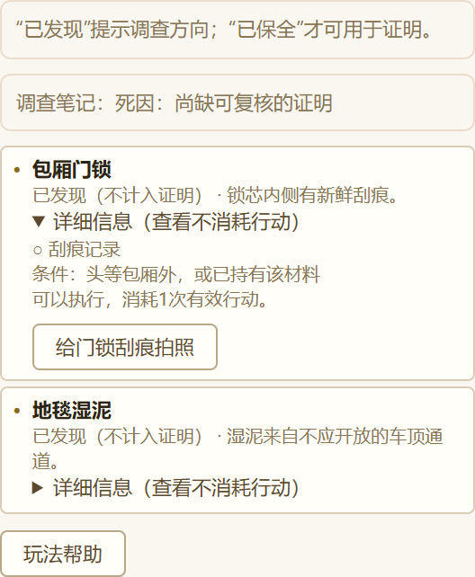
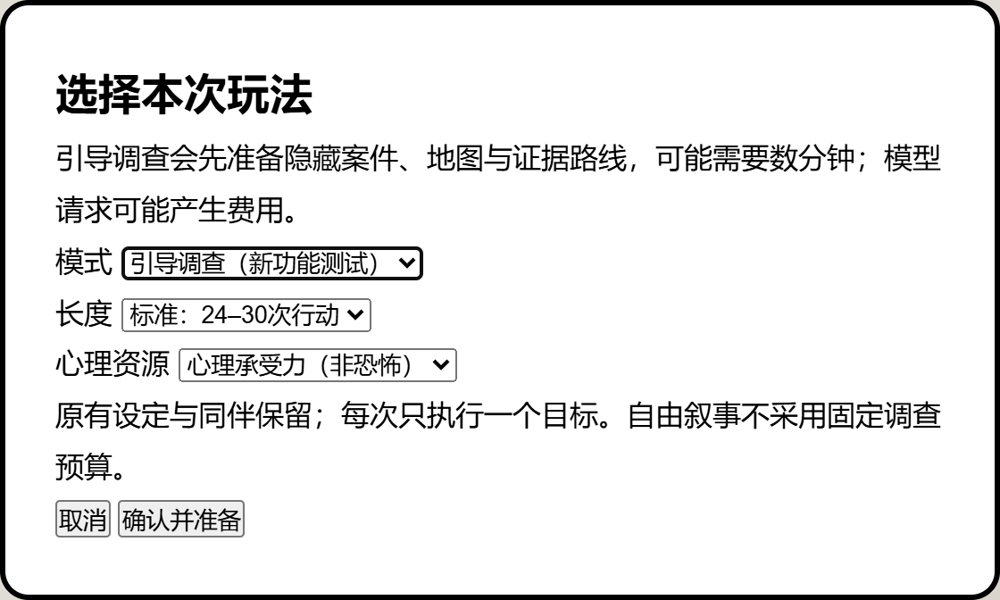

# AI+TRPG — 单人 AI 调查跑团

AI 扮演主持人，玩家通过中文或英文描述行动。规则引擎负责骰子、证据、状态与结局条件，模型负责叙事。项目采用 **CoC 风格的百分骰与简化自订规则**，并非完整实现 CoC 第七版。

## 界面预览

以下为2026-10-08版本的实际界面截图（浅色主题），包含少量白桦站开场信息。使用隔离演示会话拍摄，无付费模型调用、无玩家私人存档；截图中的模型名称是演示标记。引导调查截图仅展示玩法入口，不代表生成案件已通过真实整局验收。

### 游戏主界面

左侧管理会话与模型，中间阅读剧情、选择选项或输入自由行动，右侧查看已知地点、证据和角色状态。顶部显示调查进度、已保全证据与真相证明数量。



### 证据详情与保全行动

“详细信息”免费显示已知组件和接触条件；点击“给门锁刮痕拍照”等按钮会提交一次实际行动，并按规则检查条件、消耗行动或要求检定。仅发现线索不计入证明。



### 在哪里选择引导调查

点击左侧 **＋（新建会话）**，完成世界与玩家设定，再点击 **直接进入故事开幕**，才会出现下面的“选择本次玩法”窗口。选择 **引导调查（新功能测试）**、长度及心理资源；已开幕或已选定模式的存档不会重新弹出选择窗口。确认准备可能产生API费用，当前功能仍为实验性。



## 从哪里开始

- **新手试炼《白桦站的末班车》**：预先编写的悬疑恐怖剧本，包含人物、地点、证据与事件分支，适合验证当前玩法。
- **自由剧本**：世界设定 → 主角设定 → 关键角色 → 开幕与自由行动。并非所有白桦站专用的章节、取证与资源规则都适用于自由剧本。
- 长期目标是为任意世界观生成同样可执行的剧本。目前不能把白桦站验证结果视为任意生成世界均已验证。

### 引导调查：实验性入口

新建自由剧本，完成世界、主角与同伴设定后，点击进入开幕，可选择“引导调查”或保留“自由叙事”，并选择短／标准／长及“理智（恐怖）”或“心理承受力（非恐怖）”。已有存档不自动转换。**引导调查已接入界面，但仍为实验性功能，尚未通过真实模型整局验收；新玩家暂建议使用白桦站。**

案件准备分为“大纲 → 证据路线 → 事件与结局”三个阶段，每个请求最多一次生成／修复，浏览器保存检查点后才继续。每次准备最多六次模型生成调用；网络重试另有上限，可能增加实际请求与费用。失败保留草稿、错误与已批准阶段，不重写整个案件。“暂停准备”会在当前请求返回并保存后停止；刷新或切换回来后须手动点击“继续准备”，不会自动发起收费请求。额度耗尽后继续会获得新的六次额度；“重新准备案件”需确认，只清除未开幕草稿。开幕重试复用已验证案件，绝不替换成白桦站。

`SCENARIO_GEN`默认输出额度：SoCLaaS 16384 token、官方DeepSeek 32768 token，每次超时300秒。大纲默认Qwen medium／DeepSeek low推理；路线、事件及修复默认关闭推理，显式案件配置覆盖优先。其他兼容服务保留自身默认策略。额度包含思考和最终输出，不是输入上下文长度，也不是要求模型必须生成这么多字。普通叙事策略不变。

短／标准／长调查门槛为14／26／38次有效行动；正常调查结束后最多三次危机行动，再作一次最终决定。目标总长度为12–18／24–30／36–42次，不是每个玩家都能找齐所有证据的承诺。移动和目的地调查分开；已访问、无危险的已知路线可免费移动，查看笔记和证据详情免费。取证按钮仍须通过接触、合作、工具及危险检查；全部组件形成玩家持有副本后才计入证明。未知来源与远处证人的位置不在普通侧栏提前显示。

生成案件使用逻辑地点网络而非地图图片，事件随行动里程碑推进。危险、检定和最终决定使用共享引擎；证明不足也可明确结束。“同案重玩”复用案件，“生成另一案件”保留设定并重新准备；两者均使用新会话ID，不覆盖原结局。

2026-09-17分阶段实测：最初四次标准案件准备（历史／科幻各用Qwen和DeepSeek），每次六次调用，全部暂停于校验失败。后续授权最多四调用修复探针：一次中止、三次响应保留；三个响应通过结构／装备检查，但完整证明路线仍未在搜索预算内验证，均未开幕。已将耗时的全队列排序改为堆队列，并增加30秒搜索预算；耗尽表示“未验证”，绝不放行。九种不同题材／拓扑／上限规模夹具通过共享规则路线搜索和真实编排器假模型回放；这不等于真实模型剧情质量验收。详见[实施状态](GUIDED_INVESTIGATIONS_STATUS.md)。

检查点与最终案件均存于当前浏览器IndexedDB会话记录，不生成每局源码文件、不上传Git。隐藏草稿仅供主持人诊断使用。删除会话会同时写入永久删除标记，迟到响应无法重建该ID；清除站点数据会清除存档和标记。删除不会撤销已发出的模型费用或删除服务商记录。测试报告位于Git忽略的`.player-runtime`，与玩家浏览器存档相互独立。

准备契约现为v2：事件从引擎生成的行动目录选择，不再让模型自行拼装地点、证据和组件ID。装备能力（抄录、录音、拍照等）与说服等技能分开；有工具不等于已发现证据，有合作也不等于已保全。修复返回最多20条定位到字段的问题，连续三次出现相同问题会提前暂停，避免无进展的重复费用。六次仍是每轮上限，手动继续才获得新额度。兼容的旧准备阶段保留；无法精确映射的旧事件草稿须修复，不猜测其意图。

隔离假模型浏览器已验证失败恢复、六次额度耗尽、暂停／刷新／继续、侧栏保全、骰子取消与重载、26行动门槛及证据不足结局、同案重玩和另案准备。经授权补测准备／叙事／骰子处理中删除、双标签删除、迟到保存拒绝、刷新后不复活，以及保存／删除事务失败回滚；未触碰5173玩家存档。九种上限规模案件的五类行为共45次假模型整局全部完成。这些不代表真实Qwen／DeepSeek生成质量已通过验收；有界付费修复结果与剩余发布条件见实施状态。

## 首次准备

安装支持项目依赖的 Node.js（验证使用 Node 24）及 npm，在本目录执行：

```powershell
npm install
Copy-Item backend/.env.example backend/.env
```

仅在尚不存在 `backend/.env` 时复制示例，勿覆盖已有密钥。根目录安装脚本会安装 backend 依赖。编辑该环境文件配置 API，绝不要提交密钥。

## 启动、存档和退出

### 玩家模式：无需终端

1. 双击 **启动游戏.vbs**。
2. 启动器按需构建前端、后台运行服务，并打开默认浏览器。
3. 地址保持 **http://127.0.0.1:5173**。
4. 结束时点击 **保存并退出游戏**。等待保存完成和关闭提示后关掉标签页即可，**无需再点关闭游戏**。
5. 如果只是关了浏览器标签页，服务仍运行，可双击 **关闭游戏.vbs**。

重复启动会打开已有实例；端口被其他程序占用时提示冲突，不会终止无关程序。请求执行中不能退出；等待检定和已完成结局可以保存退出。日志和实例信息在忽略跟踪的 `.player-runtime/`。

终端也可使用同一启动器：

```powershell
node scripts/launcher.cjs
node scripts/launcher.cjs --stop
```

### 开发模式

```powershell
npm run dev:all
```

开发模式启动 Vite 和后端，不提供玩家模式的服务关闭按钮。终端 Ctrl+C 结束开发进程。
注意：现有 `predev:all` 会清理 5173/3001 端口，避免在这些端口运行其他重要服务；玩家启动器不会这样做。

### 存档在哪里

正常浏览器会话保存在 **IndexedDB** 中，前端把会话快照提交给后端处理；不是由 SQLite 为浏览器自动维护权威存档。仓库仍保留其他存储实现和相关测试，但不代表当前页面使用该方式。

使用相同浏览器、浏览器配置和来源地址。localhost 与 127.0.0.1、不同端口、无痕窗口不是同一存档空间。清除网站数据会删除浏览器存档。不要把关闭标签页当作可靠的退出/服务关闭机制。

### 删除会话与后台响应

可以在请求进行中确认删除会话。删除会同时写入只含会话ID和删除时间的标记；删除与标记在同一个IndexedDB事务完成。后续保存必须在事务中检查这个标记，因此迟到的回复或另一个标签页不能重新创建已删除的同一个会话。标记会保留到清除网站数据。

浏览器会尝试取消被删除会话的请求，并通知其他游戏标签页；**这不保证后端或模型服务停止处理，也不保证免除已发生的API费用**。如果删除事务失败，会显示错误且不移除原存档。切换会话时，未删除的旧会话响应保存在原会话，不覆盖当前显示的会话。保存后台结果不会改变当前会话选择。

数据库从版本1升级到版本2，保留现有存档。若旧标签页阻止升级，请先关闭其他游戏标签再重试。删除浏览器会话不删除提供商保留的请求或外部备份。生成案件与进度一起保存在会话记录内，不会自动写入Git仓库或生成每局源代码文件。开发者主动执行实时测试脚本时，另会在被Git忽略的.player-runtime目录写入测试报告；它不是玩家存档。

## 模型与 .env

示例（替换密钥占位符）：

```dotenv
LLM_PROVIDER=soclaas
SOCLAAS_API_KEY=your-key
SOCLAAS_MODEL=qwen3.8:27b
DEEPSEEK_API_KEY=your-key
DEEPSEEK_MODEL=deepseek-v4-flash
```

可用 `SOCLAAS_MODELS` / `DEEPSEEK_MODELS` 配置逗号分隔的额外模型；服务地址可通过对应 `*_BASE_URL` 设置。`LLM_DEFAULT_PROFILE` 可指定默认 profile，例如 `soclaas:qwen3.8:27b`。以 `backend/.env.example` 和实际服务支持的模型名称为准。

- 后端启动时从允许的环境变量构建模型列表，不会在线扫描所有模型。
- 页面选择保存在会话内，从下一次请求生效，不重置剧情。
- 修改 .env 后必须重启后端；切换页面中已配置的模型无需重启。
- 浏览器仅取得安全的模型元信息，不取得 API 密钥。
- 未配置密钥的 DeepSeek 项会显示但不可选择。
- 能力判断是代码中的模型规则，不是自动探测；未知兼容模型省略未经确认的推理字段。

### 推理强度如何切换

| 请求类型 | Qwen 3.8 / SoCLaaS | 直接 DeepSeek |
|---|---|---|
| 普通叙事、重大事件、战斗、掷骰后续 | reasoning_effort: none | thinking disabled |
| 历史摘要、世界生成 | none | disabled |
| 人物与关键人物生成 | medium | enabled |
| 最终结局生成 | medium | enabled |
| 隐藏案件准备 | medium，最多16384输出token | enabled + low，最多32768输出token |

这是**按请求类型**切换，不随游戏时钟、危机强度或 SAN 自动增加推理。选定的模型也不会在结局自动换成另一家服务。

Qwen 参数优先级为：**profile 的流程策略 → 组装请求设置 → provider/.env 回退值**。因此 `SOCLAAS_REASONING_EFFORT=medium` 不覆盖普通叙事的 none 策略。
DeepSeek 的 `LLM_THINKING_TYPE=enabled/disabled` 是显式覆盖；测试自动策略时保持未设置。

2026-09-17按[官方模型文档](https://api-docs.deepseek.com/quick_start/pricing/)更新：V4.1 Flash使用API标识`deepseek-flash`。官方也将旧`deepseek-v4-flash`请求映射到新Flash，因此改名不代表一定更换了底层模型。[当前API文档](https://api-docs.deepseek.com/api/create-chat-completion/)支持`reasoning_effort: none/low/high/max`；本项目仅对已识别的官方DeepSeek模型启用，未知兼容端点仍不发送该参数。非思考叙事不发送会重新开启推理的effort值。

高级用户可用`SOCLAAS_SCENARIO_MAX_TOKENS`、`SOCLAAS_SCENARIO_REASONING_EFFORT`、`SOCLAAS_SCENARIO_TIMEOUT_MS`单独覆盖案件准备，DeepSeek用同名`DEEPSEEK_`前缀。通用`LLM_SCENARIO_*`优先级较低。这些设置不会增大普通叙事请求，也不会扩展提供商服务器的上下文容量。默认无需填写；修改后重启后端，再在会话侧栏确认选中目标模型。增加额度和超时可能增加等待与费用，不能修复所有格式错误。
人物与结局的默认请求超时为 150 秒，普通叙事 120 秒，摘要 90 秒；流程策略优先于全局超时回退值。超时不自动按普通网络重试次数无限重发。

一次玩家行动可能产生叙事、校验重试、骰后叙事、摘要等多次 API 调用，不能用请求数当回合数。
模型生成使用非流式 API；页面的 SSE 用于进度、判定及结果推送，不等于模型逐 token 流式生成。

## 新手试炼：如何玩

1929 年深秋，你作为调查记者追查同行顾言在反锁包厢中的死亡。暴雨使雾港号停在白桦站，旧矿难、“第七个人”和被篡改的记录逐渐进入调查。

使用下方 A/B/C 选项或自由输入。一条请求处理一个主要意图；不要把多次独立搜查、移动、交涉塞进一句话期待全部成功。输入 **玩法帮助** 或点击证据栏按钮可以重新阅读帮助。

### 发现不等于保全

证据侧栏不是预先暴露答案的清单：仅显示已遇到的线索。

- **已发现**：你知道线索存在；还不是完整的可复核证据。
- **已保全**：通过相应的方法形成了记录、样本或副本，可用于证明。
- **执行保全行动**：把该线索的自然语言保全方式作为一次正常行动提交，不绕过危险、接触范围或工具条件。

例子：

```text
记录地毯湿泥
把地毯边缘的泥粒装袋取样，标注发现位置
Take photos of the door lock scratches
```

第一句只记录观察，不应描述已经装袋。第二句是采样，第三句是拍照。完成后看系统回执，而不只看旁白：
**已发现 / 证据已保全 / 已经保全 / 尚未完成**。无法完成时会说明需要的地点、工具或证人合作。

组合证据需要组成部分相互印证：针孔照片不能代替对应的药物记录。对“这些材料”等多义指代，系统可能先要求明确名称；这不消耗压力。取证包包含基础摄影、记录和取样工具。

### 技能与检定

基本可接触线索不靠一次成功骰才能出现。需要额外洞察、隐蔽信息、证人合作或危险行动时才检定。

- 侦查：隐藏细节；图书馆使用：解读和对照文件。
- 说服：争取信任或谈判；心理学：判断具体表现。
- 聆听：偷听或听辨；闪避：应对身体危险。
- 检定前先看目的与失败代价，再确认；相同不变的失败尝试不能反复刷骰。
- 骰子确认与后续叙事是一项行动；取消会回滚未完成行动。

### HP、SAN 与照顾自己

自订规则，非完整 CoC：

| 资源 | 规则与选择 |
|---|---|
| HP | 主角初始 11。轻度冲突失败 1d3；特定危险路径 1d6；明确跳入极危险区域可能 2d6。以确认前提示为准。 |
| 伤势 | HP 不高于一半，或未处理的单次重伤，影响剧烈身体检定；不会让普通谈话和安全取证全部变难。 |
| 包扎 | 安全处输入“包扎伤口”，每伤一次、最多恢复 2 HP。新局两份敷料，每次治疗消耗一次行动。 |
| SAN | 主角初始 60。首次真正接触异常才检查，远方提示本身不等于看见隐藏恐怖。 |
| SAN 损失 | 不安 0/1d3，重大 0/1d4+1，灾变 1/1d6，依成功/失败选择。 |
| 压力后果 | 失败影响下一次相关集中/观察检定；单次损失至少 5 则影响两次。低 SAN 仅影响相关技能，惩罚骰合计最多两枚。 |
| 稳定情绪 | 安全处输入“稳定情绪”，消耗一次行动、清除暂时压力，不直接补 SAN；每局两次。 |
| 成就恢复 | 在规则认可的成功证人交涉及解除中央冲突后，各可恢复 2 SAN 一次，不超过起始值。 |

HP/SAN 到零会触发终止结局。战斗目的通常是保护资料、脱身或谈判，不是杀死所有人。主动退让可能失去原件或现场控制权，但不会凭空抹掉已取得的副本。

这些数值用于虚构恐怖游戏，不是对现实心理健康的描述。

### NPC 的“状态”

NPC 的精确 HP/SAN 不显示。观察到的身体/情绪描述可以更新，即使苏棠、林晚的内部数值仍为空。
“尚未观察”不等于健康，也不等于 NPC 永远没有状态。离开后的情况只代表上次观察，不透露未见到的幕后变化。

## 新版章节与压力

新局 pacingVersion=3；旧局保留原时间线。

| 阶段 | 节奏 |
|---|---|
| 开端 | 至少四次行动与矛盾线索，最迟第六次进入调查 |
| 分支调查 | 画作、档案、证人；第十二次起可以推进，最迟第十六次进入中央冲突 |
| 中央冲突 | 最多三次完成的交锋，失败也会有明确退出结果 |
| 收束 | 整理已发现线索、保全与证人意向，而非无限开启支线 |
| 发车压力 | 第22次提醒，第24次开放承诺，第26次到达截止 |
| 终局 | 最多剩余三次危机行动，然后一次最终决定 |

24–30 是有意义行动的目标，不是把 API 请求或免费的帮助当行动。探索熟悉安全区域的单独移动不增加压力；新路线与危险移动会增加。时刻仅是近似氛围，不再由模型自由决定进度。

中央冲突结束后可以自愿提前承诺，但第24次有效行动前仍保留普通调查选项，不会把四个按钮全部换成结局。收束提示会列出已保全数量、真相证明和已发现材料的缺口。危机中提交最终决定会被记住，先完成剩余危机再自动写结局，**无需再选一次**。证据不足会得到不完整案件结局，不妨碍结束。

### 证据详情与行动预检

新版试炼的证据卡可展开“详细信息”：免费查看每个组件的保存状态、已知地点或人物条件、当前阻碍和可执行的下一步。未知地点只显示“材料来源尚待调查”，不会显示人物的秘密实时位置。按钮发送明确的结构化动作，服务端仍重新验证接触、工具及材料条件。已保存的副本可以随身处理。

每次提交处理一个有意义目标。移动与到达后的调查分开；“拍照并放比例尺、标注位置”属于同一目标。画作和名册同场对照也可一起完成。不同地点、多步骤或明确缺少已知条件的请求，会免费要求修改输入，不推进事件或压力。实际检定失败仍计行动；查看详情、帮助与澄清不计。

例：输入“进入行李车并调查湿泥”会提示先移动；输入“给门锁刮痕拍照，放置比例尺并标注位置”正常执行。熟悉安全路线的纯移动不增加压力；未知目的地不能直接跳转，危险中移动仍按危机行动处理。前往已知区域可走已知路径，但不能直接跨过中间的危险区域。

解析目前采用确定性规则与免费澄清，不增加额外模型调用。单目标创意行动仍交给叙事流程，但关键证据效果由规则结算。复杂自然语言并非完全可判定；若措辞未被识别，请用明确的目标或证据卡按钮。旧版计时存档不强行套用新版预检。

### 场景与证人规则

- 宣告围堵后，玩家的第一条回应已经按危机处理。“利用两人的分歧进行谈判，争取带着现有证据脱身”会先进行说服检定，不等待下一轮才激活战斗。取消骰子会恢复事件及危机状态。
- 林晚的证词不再绑定乘务员休息室：本人同场、可交流且同意合作时，可以在其他地点录音。已经携带的证词副本可在她离开后复制，但不能凭空补出未取得的检修图。
- 成功说服必须明确针对林晚并且能够接触她。在同一条输入中同时要求说服和录音时，本次先建立合作，下一行动再听取、检定SAN并保存，避免跳过揭露过程。
- 她同意合作后，可输入“与林晚一起进入站务楼候车厅”等明确同行行动。旁白不能自行改变NPC的实际位置。
- 新版事件的过期与受保护回应窗口按行动压力计算，不再受氛围时刻影响。旧版存档保留旧计时逻辑。
- 信号灯SAN要求在站台观察信号灯且广播已触发；停电SAN对应包厢走廊的亲历分支；证词SAN要求已经取得合作并实际询问证词。每项仍只结算一次。

## 剧透：证据与测试路线

以下是剧本结构，不保证 NPC 在任何说法下都会合作：

- 死因：门锁 + 针孔/医疗记录。
- 掩盖行为：调度记录 + 医疗转运档案。
- 第七人：顾言录音 + 苏棠画作/乘客名册。
- 责任链：针孔/医疗记录 + 调度记录 + 林晚证词。

路线示例：保全门口痕迹 → 询问死因 → 调查画作与录音 → 进入开放的办公室 → 处理档案威胁 → 核对医疗记录 → 争取林晚合作 → 应对夺证 → 整理缺口并决定公开、带走、压下或撤离。
地下探索是可选深度，代价是危险与行动预算。失败检查、绕路和不合作会改变路线，不应机械照抄某份27步攻略。

## 开发与验证

主要代码：
- `backend/src/orchestrator/`：流程、重试、骰子事务、终局。
- `backend/src/services/InvestigationDirector.js`：新版行动、证据、章节和观察。
- `backend/src/services/DamageResolver.js`：骰子与伤害。
- `backend/src/scenarios/birchStation.js`：预编写剧本。
- `src/ui/` 与 `src/persistence/`：页面、IndexedDB。

```powershell
npm --prefix backend run test:all
node backend/test/test-investigation-director.js
npm run build
```

旧时间制回归与新章节测试是两组测试。模型配置测试不访问真实 API。
可选真实测试（消耗配额、使用独立内存会话、不改浏览器存档）：

```powershell
cd backend
node test/live-birch.js soclaas:qwen3.8:27b --full
node test/live-birch.js deepseek:deepseek-v4-flash --full
```

模型名称须匹配当前配置。不开 --full 则仅做终局冒烟。模拟通过不代表真实模型文笔或人类可玩性通过；请分别记录。

## 已知边界与排错

- 自由语言意图目前采用可解释的中英文模式匹配；复杂隐喻和含糊指代仍可能需要改写。证据按钮可减少歧义。
- 旁白一致性有引擎结果约束与重复/不支持效果检查，但不是对任意自然语言的语义证明。若收到简短保底结果，表示模型内容未可靠表达该回合。
- NPC 观察只依据当前可接触状态，不能从无记录存档补出可靠的历史伤势。
- API 超时先检查 God’s-eye 的模型、流程、延迟、token 与重试。更高 reasoning 不自动修复机制问题。
- 旧存档不自动获得新章节，测试新版节奏请新开试炼。重启服务后再测试代码改动。
- God’s-eye 包含内部编号与剧透，正常面板不应显示这些信息。

规则设计参考：[Chaosium BRP Quick-Start](https://www.chaosium.com/content/FreePDFs/BRP/CHA2021%20-%20Basic%20RolePlaying%20Quick-Start.pdf)、[CoC Quick-Start](https://www.chaosium.com/cthulhu-quickstart/)、[Fate Stress & Consequences](https://fate-srd.com/fate-core/stress-consequences)。本项目的治疗量、惩罚和章节限制是自订规则。

## License

MIT
